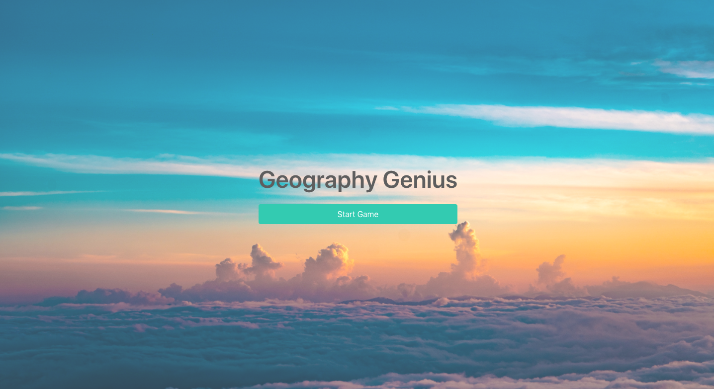
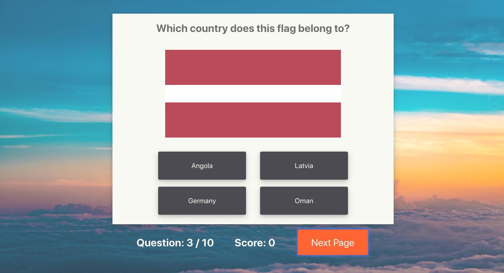
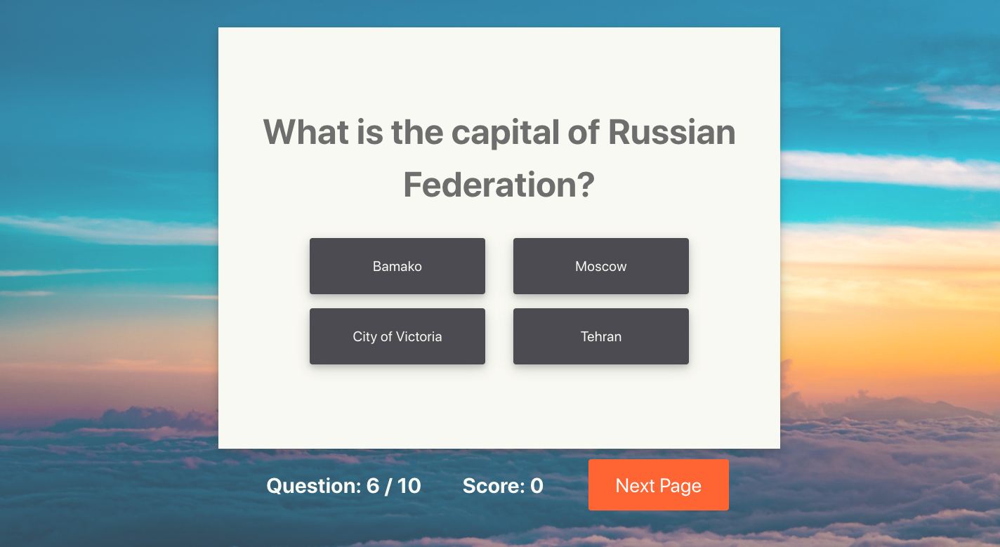
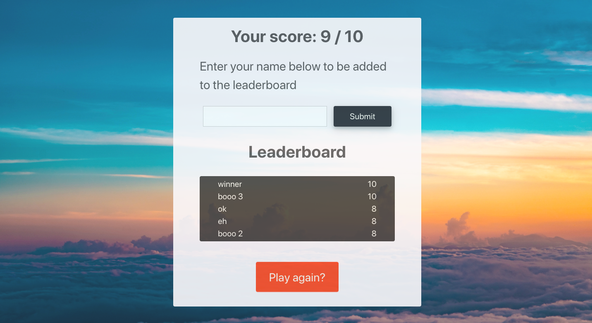

# Geography Genius

##  General Assembly: Software Engineering Immersive - Project 2

[Click here to open the application on Heroku](https://geography-genius.herokuapp.com/)

## Overview

This was a quiz about country capitals and flags created after 2 days of pair coding with a [course mate](https://github.com/Tbanks9). We built it in React and used Axios requests to a third-party API called [Rest Countries](https://restcountries.eu/) to collect the quiz’s data. I wrote the majority of the logic using JavaScript while my partner focused on the visuals and animations. I felt we worked very well together, creating a successful application despite extremely limited time and the difficulty of building a quiz using an API that was not designed for that purpose.

## Goal
To create an application with React that interacts with a third-party API. 

### Timeframe
2 days

### Technologies used
JavaScript, React, Axios, Sass, Bulma, Animate.css, Google Fonts, Git, Yarn, GitHub, Insomnia.

## Instructions
Test your geography knowledge in our quiz based on country capitals and flags. You will be given 10 random questions in the following formats:

- Which country does this flag belong to?

- What is the flag of this country?

- What is the capital of this country?

Once finished, enter your name to add your score to the leaderboard.

## Development

We built the application in React and used Axios request to a third-party API called [Rest Countries](https://restcountries.eu/) to generate the data for this quiz.

The quiz consisted of ten questions, each randomly choosing one of three question types mentioned above. The quiz would then randomly choose one correct answer and three incorrect answers from the API to generate a question. For example, it might randomly select the country capitals question type and then randomly choose France from the database of countries, accessing the capital city data for the correct answer of Paris. It would do the same for three more random countries, checking to not produce duplicates, producing a total of four possible capital city answers, only one of which is correct.

We included measures to prevent the player from selecting the correct answer after they had already selected an incorrect answer to prevent cheating. Correct answer were indicated by a bobbing green animation and incorrect answers by a shaking red one.

## Challenges

The biggest challenge of this application was the very short timeframe we were given to complete the project. It was also our first project using React so there was a learning curve to contend with. The API we were using was just a simple database that was not designed for quizes, resulting in us having to write a lot more code than we might have needed to otherwise. Each question type needed to have its own customised JavaScript, HTML, and CSS as each operated differently.

## Wins

This was my first group project and I felt that we worked really well together. We played to our strengths: I came up with most of the game logic in JavaScript while my partner made it look beautiful with CSS and animations.

## Future features

Due to the very limited timeframe and the need for each question format to have its own unique code, there were several question formats that we did not have time to do:
- What country is the pin on this map pointing to?
- Which country has the highest population, land area, GDP, etc
- Which country has these neighbours?

We also considered ways of making the quiz more difficult such as creating preset questions that grouped similar looking flags together or filtering out well known countries from the possible answers.

## Key learnings

I learned a lot about React during this project (by making a lot of mistakes). I also learned it was possible to create something fairly polished and professional-looking in 2 days.

## Authors
- Nicolas Dolan
- [Tim Banks](https://github.com/Tbanks9)